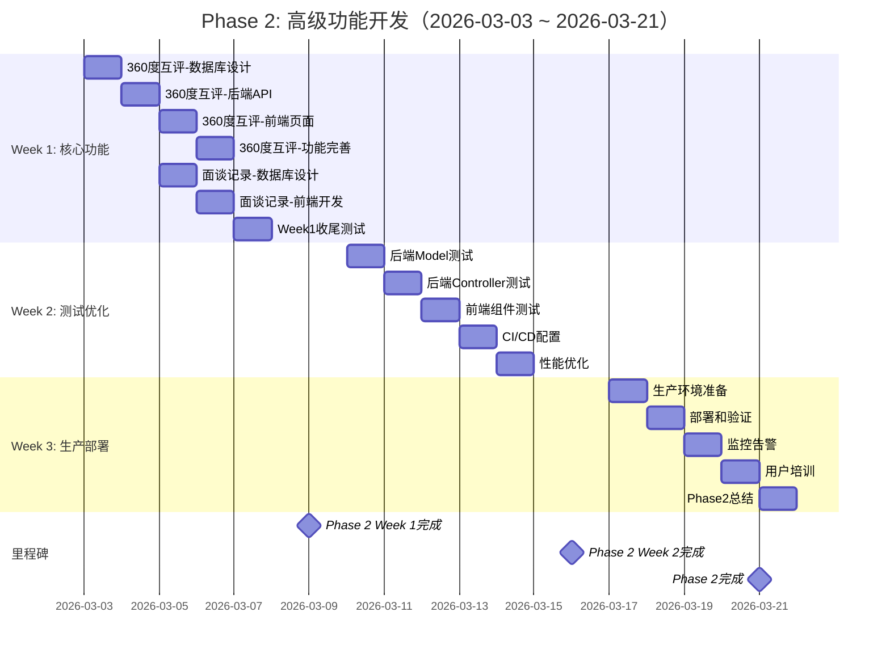
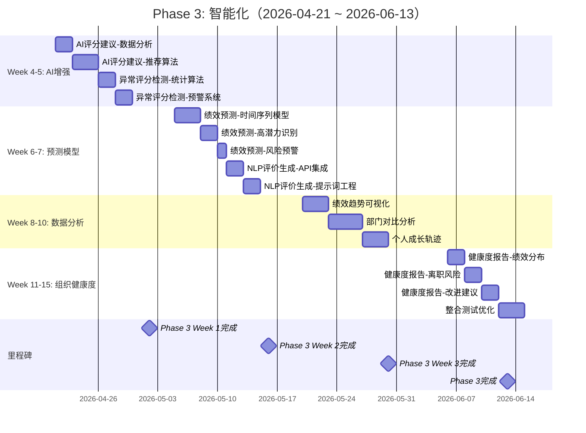
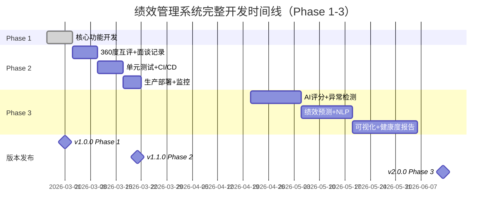
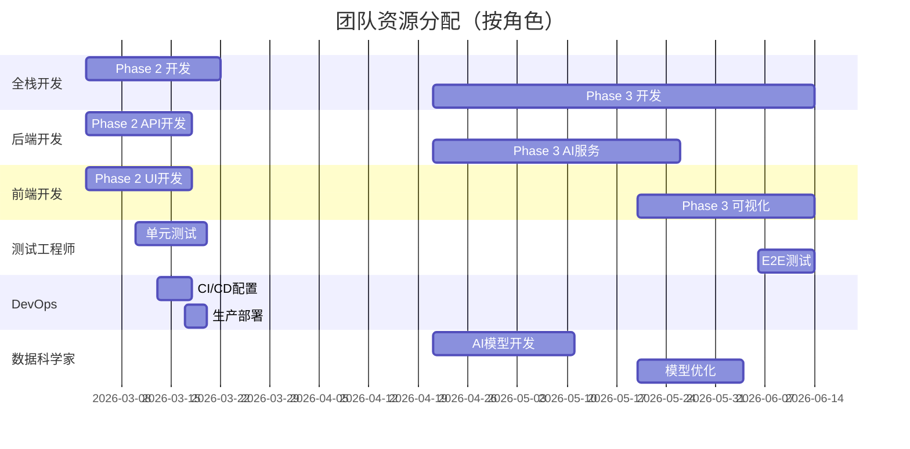
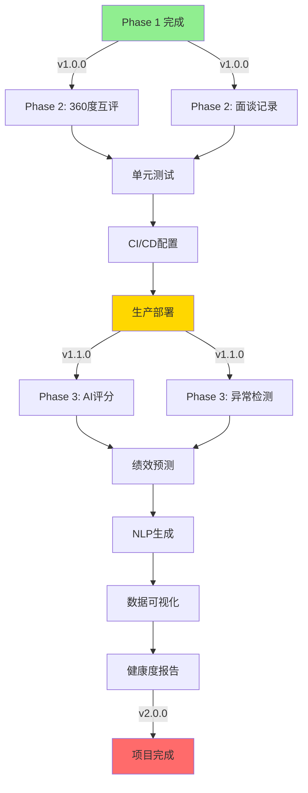

# Phase 2 & 3 甘特图

> 项目: 绩效管理系统 - Phase 2 & 3  
> 时间范围: 2026-03-03 ~ 2026-06-13  
> 总周期: 15周  

---

## Phase 2 甘特图（Week 1-3）



---

## Phase 3 甘特图（Week 4-15）



---

## 完整时间线总览



---

## 资源分配甘特图



---

## 关键路径分析

### Phase 2 关键路径
```
360度互评 → 面谈记录 → 单元测试 → CI/CD → 生产部署
   (5天)      (3天)      (5天)     (2天)    (3天)
   
总计: 18天（含周末休息3天 = 21天 = 3周）
```

### Phase 3 关键路径
```
AI评分建议 → 异常检测 → 绩效预测 → 可视化 → 健康度报告
   (5天)      (4天)     (6天)     (10天)    (6天)
   
总计: 31天工作日（含周末 ≈ 54天 = 8周）

实际时间线: 2026-04-21 ~ 2026-06-13（~8周）
```

---

## 依赖关系图



---

## 并行任务优化

### Phase 2 并行策略
```
Week 1: 
  开发者A: 360度互评后端
  开发者B: 面谈记录前端
  （2天后交叉集成）

Week 2:
  开发者A: 后端测试
  开发者B: 前端测试
  DevOps: CI/CD配置（并行）

Week 3:
  全员: 生产部署（串行）
```

### Phase 3 并行策略
```
Week 4-5:
  数据科学家: AI模型开发
  后端开发: API接口准备
  （独立并行）

Week 8-10:
  前端开发: 可视化组件
  后端开发: 数据聚合API
  （并行开发，最后集成）
```

---

## 风险缓冲时间

### 已预留缓冲
- Phase 2: 每周预留1天缓冲（周五）
- Phase 3: 每2周预留2天缓冲
- 总缓冲时间: ~10天（约15%）

### 应急措施
如果进度落后:
1. **Week 1延期** → 压缩IDP功能（延后到Phase 3）
2. **Week 2延期** → 降低测试覆盖率目标（60% → 50%）
3. **Week 3延期** → 简化监控配置
4. **Phase 3延期** → 削减非核心AI功能

---

## 里程碑检查点

| 日期 | 里程碑 | 验收标准 | 风险等级 |
|------|--------|----------|----------|
| 2026-03-01 | Phase 1 完成 ✅ | 测试100%通过 | ✅ 低 |
| 2026-03-09 | Phase 2 Week 1 | 2个功能上线 | ⚠️ 中 |
| 2026-03-16 | Phase 2 Week 2 | 覆盖率60%+ | ⚠️ 中 |
| 2026-03-21 | Phase 2 完成 | 生产稳定运行 | 🔴 高 |
| 2026-05-02 | Phase 3 Week 1 | AI准确率90%+ | ⚠️ 中 |
| 2026-05-16 | Phase 3 Week 2 | 预测偏差<10% | ⚠️ 中 |
| 2026-05-30 | Phase 3 Week 3 | 图表<1s渲染 | ⚠️ 中 |
| 2026-06-13 | Phase 3 完成 | 完整验收 | 🔴 高 |

---

## 使用说明

### 在Markdown中查看
- GitHub/GitLab: 自动渲染Mermaid图表
- VS Code: 安装Mermaid插件
- Obsidian: 原生支持Mermaid

### 导出为图片
```bash
# 使用 mermaid-cli
npm install -g @mermaid-js/mermaid-cli
mmdc -i GANTT_CHART.md -o gantt-phase2.png -t forest
```

### 交互式查看
- 使用HTML版本（见下一个文件）
- 导入到项目管理工具（Jira/Trello/Monday）

---

**生成时间**: 2026-03-01  
**计划周期**: 15周  
**总工时**: 约56个工作日
